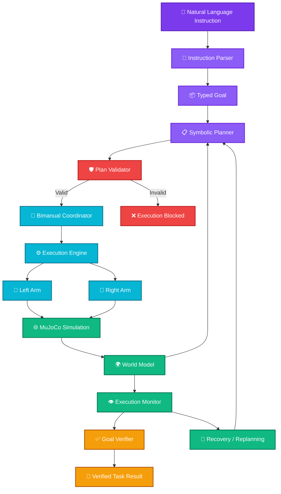
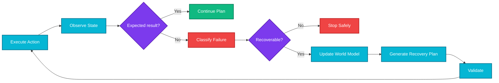

<div align="center">


<sub>Animated banner via <a href="https://github.com/kyechan99/capsule-render">capsule-render</a> — drop in <code>docs/assets/taskforge-banner.png</code> to swap in final brand art later.</sub>

<br/>
<br/>

# 🤖 TaskForge VLA

### Adaptive Language-Guided Bimanual Manipulation


<br/>

[](https://github.com/builtbyrehan/taskforge-vla/releases)
[](https://github.com/builtbyrehan/taskforge-vla/actions)
[](https://www.python.org/)
[](https://mujoco.org/)
[](#license)

<br/>

[](https://github.com/builtbyrehan/taskforge-vla/stargazers)
[](https://github.com/builtbyrehan/taskforge-vla/network/members)

<br/>
<br/>

<a href="https://lablab.ai/ai-hackathons/ai-infra-summit-hackathon"></a>
<a href="https://www.ai-infra-summit.com/ai-infra-hackathon"></a>

<sub>Santa Clara Convention Center · Sept 15–17, 2026 · co-organized by <a href="https://www.kisacoresearch.com">Kisaco Research</a> & <a href="https://lablab.ai">lablab.ai</a> — full sponsor roster in the Hackathon section below</sub>

</div>

---

## ✨ What is TaskForge?

**TaskForge VLA** is a simulation-first embodied AI system that lets people control two robotic arms using natural-language instructions.

Instead of manually programming every joint movement, a user describes the task:

> **"Pick the red block with the left arm and pick the blue block with the right arm."**

TaskForge turns that instruction into a structured robot plan, checks whether the plan is valid, assigns actions to the robots, executes them in **MuJoCo**, and observes what actually happened.

The goal is simple:

### **Make robots programmable through intent, not scripts.**

---

## 🎯 The Idea

Traditional robot programming often looks like this:

```text
Move joint 1
Rotate joint 2
Move to coordinate X
Close gripper
Move to coordinate Y
Open gripper
```

TaskForge aims for this instead:

```text
"Put the red block beside the blue block."
```

And the system figures out the steps required to achieve that goal.

---

## 🧠 Core Principle

> ### AI proposes. Structured systems validate. Deterministic robotics executes. The environment decides whether the action actually succeeded.

TaskForge does **not** give an LLM direct control over robot joints.

Instead, intelligence and robot control are separated into clear layers.

```text
Human Intent
     ↓
Structured Goal
     ↓
Planning
     ↓
Validation
     ↓
Robot Actions
     ↓
Environment
     ↓
Observation
     ↓
Verification / Recovery
```

---

# 🚀 Current Prototype

The current prototype already supports an end-to-end pipeline from **natural-language input to dual-arm simulated execution**.

### ✅ Working now

- 🗣️ Natural-language robot instructions
- 🧠 Typed goal parsing
- 📋 Automatic symbolic plan generation
- 🌍 Structured world-state representation
- 🛡️ Plan validation before execution
- 🤖 Two independently controlled simulated robot arms
- 🦾 Inverse-kinematics based arm movement
- ✋ Simulated gripper control
- 📦 Object pick manipulation
- 🔗 Plan dependencies
- ⚙️ Deterministic execution engine
- 📍 Spatial predicates such as `left_of`, `right_of`, and `near`
- 🔎 World-state observation before and after execution
- ❌ Invalid-object rejection
- 🧾 Structured execution results

### Example

Input:

```text
Pick the red block with the left arm and pick the blue block with the right arm.
```

TaskForge parses it into:

```json
{
  "goal_type": "multi_pick",
  "commands": [
    {
      "actor": "left_arm",
      "action": "pick",
      "target": "red_block"
    },
    {
      "actor": "right_arm",
      "action": "pick",
      "target": "blue_block"
    }
  ]
}
```

Then generates:

```text
a1 → left_arm  → PICK(red_block)
a2 → left_arm  → MOVE_HOME
a3 → right_arm → PICK(blue_block)
a4 → right_arm → MOVE_HOME
```

The plan is validated **before the robots are allowed to move**.

---

# 🏗️ Architecture



> Some components shown above are part of the planned complete architecture.  
> See **Development Status** below for what is implemented today.

---

# 🔄 The TaskForge Loop

The full system is designed around this loop:

```text
GOAL
  ↓
OBSERVE
  ↓
UNDERSTAND
  ↓
PLAN
  ↓
VALIDATE
  ↓
COORDINATE
  ↓
ACT
  ↓
OBSERVE
  ↓
DETECT
  ↓
REPLAN
  ↓
RECOVER
  ↓
VERIFY
```

The key idea is that:

> **Finishing a list of robot actions does not automatically mean the user's goal was achieved.**

TaskForge ultimately verifies the final state of the environment.

---

# 🛡️ Validation Before Execution

One of TaskForge's most important design decisions is that generated plans cannot directly control the robots.

For example, if a planner creates:

```json
{
  "action": "pick",
  "target": "unicorn",
  "actor": "left_arm"
}
```

but `unicorn` does not exist in the world model, TaskForge rejects it:

```text
PLAN_INVALID ✗

[UNKNOWN_OBJECT]
Object 'unicorn' does not exist in world state.

Execution blocked.
Robot will NOT execute an invalid plan.
```

This creates a strict boundary:

```text
AI / Planner
     ↓
Proposed Plan
     ↓
┌─────────────────────┐
│    PLAN VALIDATOR   │
├─────────────────────┤
│ Object exists?      │
│ Actor exists?       │
│ Action supported?   │
│ Dependencies valid? │
│ Graph acyclic?      │
│ Object graspable?   │
└──────────┬──────────┘
           │
         VALID
           ↓
       EXECUTION
```

---

# 🤖 Why Two Arms?

Manipulation becomes much more interesting when more than one robot is involved.

TaskForge is designed to reason about:

- which arm should perform an action;
- whether an object is reachable;
- whether actions depend on each other;
- whether the robots can work independently;
- whether one arm should hold something while the other manipulates it;
- whether actions should run sequentially or concurrently.

A future cooperative task could look like:

```text
LEFT ARM
    ↓
hold(container)

RIGHT ARM
    ↓
pick(block)
    ↓
place_inside(block, container)

LEFT ARM
    ↓
release(container)
```

---

# 🌍 Structured World Model

TaskForge maintains a machine-readable representation of the environment.

Example:

```json
{
  "objects": {
    "red_block": {
      "object_class": "block",
      "position": [0.15, 0.0, 0.45],
      "graspable": true,
      "grasped_by": null
    }
  },

  "robots": {
    "left_arm": {
      "end_effector_position": [-0.35, 0.0, 1.08],
      "gripper": "open",
      "status": "idle"
    }
  },

  "obstacles": [],
  "relations": []
}
```

The **world state is authoritative**.

Natural-language model output is not.

---

# 📐 Spatial Reasoning

TaskForge is designed to understand goals using geometric predicates.

Current predicates include:

```text
left_of(A, B)
right_of(A, B)
near(A, B)
grasped_by(A, robot)
```

Planned predicates include:

```text
inside(A, B)
on(A, B)
```

This allows instructions to eventually describe **relationships instead of coordinates**:

```text
"Put the spoon to the left of the plate."
```

Instead of requiring:

```text
Move spoon to [0.213, -0.091, 0.052]
```

---

# ⚙️ Tech Stack

<div align="center">

| Layer | Technology |
|---|---|
| 🧠 Core Logic |  |
| 🤖 Robotics Simulation |  |
| 📐 Robot Control | Inverse Kinematics + Position Control |
| 📦 Typed Schemas |  |
| 🌍 World Representation | Structured Python/Pydantic Models |
| 🛡️ Validation | Deterministic Plan Validator |
| 📋 Planning | Symbolic Planner |
| 🗣️ Language | Rule-Based Parser → LLM Integration Planned |
| 🌐 API |  *(planned)* |
| ⚡ Realtime Events |  *(planned)* |
| 💻 Dashboard |   *(planned)* |
| 💾 Run Storage |  / JSONL *(planned)* |

</div>

<sub>Logos and hex colors above are checked against the live [Simple Icons](https://simpleicons.org/) registry — MuJoCo and WebSockets don't have entries there yet, so those stay as plain badges rather than guessed icons.</sub>

---

# 📸 Demo

<div align="center">


### 🎬 End-to-End Demo


<sub>Natural-language instruction → validated plan → dual-arm execution</sub>

</div>

<br/>

<table border="0">
<tr>
<td width="50%" align="center">

### 🤖 MuJoCo Simulation


</td>

<td width="50%" align="center">

### 🧠 Structured Planning


</td>
</tr>
</table>

> 🚧 **Not yet captured.** These three paths don't have real files behind them, so they'll show as broken images until you add them. Record the actual `main.py` run (OBS or `asciinema` → GIF works well), grab two PNGs of the MuJoCo viewer mid-pick, and save them into `docs/assets/` with the exact filenames above — the rest of this README is already wired to pick them up automatically.

---

# 🗂️ Project Structure

```text
taskforge/
│
├── main.py
│
├── models/
│   └── scene.xml
│
├── taskforge/
│   │
│   ├── execution/
│   │   ├── __init__.py
│   │   └── executor.py
│   │
│   ├── instruction/
│   │   ├── __init__.py
│   │   └── parser.py
│   │
│   ├── planner/
│   │   ├── __init__.py
│   │   └── symbolic_planner.py
│   │
│   ├── robot/
│   │   ├── __init__.py
│   │   ├── arm.py
│   │   └── ik.py
│   │
│   ├── schemas/
│   │   ├── goal.py
│   │   ├── plan.py
│   │   └── world.py
│   │
│   ├── simulation/
│   │   ├── __init__.py
│   │   └── mujoco_backend.py
│   │
│   ├── validator/
│   │   ├── __init__.py
│   │   └── plan_validator.py
│   │
│   └── world_model/
│       ├── __init__.py
│       ├── observer.py
│       └── predicates.py
│
├── docs/
│   └── assets/
│       ├── taskforge-banner.png
│       ├── taskforge-demo.gif
│       ├── simulation.png
│       └── planning.png
│
├── .gitignore
├── README.md
└── LICENSE
```

---

# 🧪 Quick Start

## 1. Clone the repository

```bash
git clone https://github.com/builtbyrehan/taskforge-vla.git
cd taskforge-vla
```

---

## 2. Create a virtual environment

### Windows PowerShell

```powershell
python -m venv my-venv
.\my-venv\Scripts\Activate.ps1
```

### Linux / macOS

```bash
python3 -m venv my-venv
source my-venv/bin/activate
```

---

## 3. Install the current prototype dependencies

```bash
pip install mujoco pydantic
```

---

## 4. Run TaskForge

```bash
python main.py
```

You should see:

```text
TASKFORGE VLA
Phase 7 - Natural Language + Symbolic Planning

Enter a robot instruction.

TaskForge >
```

Try:

```text
Pick the red block with the left arm and pick the blue block with the right arm.
```

---

<details>

<summary><b>🔧 Click to view expected pipeline output</b></summary>

<br/>

TaskForge should first generate a structured goal:

```json
{
  "goal_type": "multi_pick",
  "commands": [
    {
      "actor": "left_arm",
      "action": "pick",
      "target": "red_block"
    },
    {
      "actor": "right_arm",
      "action": "pick",
      "target": "blue_block"
    }
  ]
}
```

Then a plan similar to:

```text
a1 → left_arm  → pick(red_block)
a2 → left_arm  → move_home
a3 → right_arm → pick(blue_block)
a4 → right_arm → move_home
```

The plan must pass:

```text
PLAN_VALID
```

before execution begins.

Successful completion currently ends with:

```text
TASKFORGE SUCCESS
```

</details>

---

# 💬 Current Example Commands

The current deterministic parser supports commands such as:

```text
Pick the red block with the left arm.
```

```text
Pick the blue block with the right arm.
```

```text
Pick the red block with the left arm and pick the blue block with the right arm.
```

```text
Pick both blocks.
```

Natural-language support will expand as the LLM interpretation layer is introduced.

---

# 🧩 Development Status

| Capability | Status |
|---|:---:|
| MuJoCo scene | ✅ |
| Single-arm motion | ✅ |
| Dual-arm control | ✅ |
| Inverse kinematics | ✅ |
| Gripper control | ✅ |
| Pick primitive | ✅ |
| Structured world state | ✅ |
| Spatial predicates | ✅ |
| Typed goal schema | ✅ |
| Rule-based language parser | ✅ |
| Symbolic planner | ✅ |
| Plan dependency handling | ✅ |
| Plan validator | ✅ |
| Execution engine | ✅ |
| Invalid-plan blocking | ✅ |
| Place primitive | 🚧 |
| Final goal verification | 🚧 |
| LLM semantic planner | 🔜 |
| Dynamic arm coordinator | 🔜 |
| Execution monitoring | 🔜 |
| Failure detection | 🔜 |
| Replanning / recovery | 🔜 |
| FastAPI backend | 🔜 |
| React dashboard | 🔜 |
| Disturbance injection | 🔜 |
| Benchmark suite | 🔜 |
| Voice input | 🧪 Stretch |
| Camera perception | 🧪 Post-MVP |
| Physical robot integration | 🧪 Post-MVP |

---

# 🛣️ Roadmap

### ✅ Milestone 1 — Robot Foundation

```text
MuJoCo
  ↓
Arm Control
  ↓
IK
  ↓
Gripper
  ↓
Pick
  ↓
Dual Arm
```

### ✅ Milestone 2 — Structured Intelligence

```text
World Model
  ↓
Predicates
  ↓
TaskPlan
  ↓
Executor
  ↓
Validator
```

### ✅ Milestone 3 — Language-to-Robot Pipeline

```text
Natural Language
  ↓
ParsedGoal
  ↓
Symbolic Planner
  ↓
Validated TaskPlan
  ↓
Robot Execution
```

### 🚧 Milestone 4 — Real Manipulation Goals

```text
PICK
  ↓
MOVE
  ↓
PLACE
  ↓
RELEASE
  ↓
VERIFY
```

### 🔜 Milestone 5 — Adaptive Intelligence

```text
LLM Reasoning
  ↓
Structured Proposal
  ↓
Validation
  ↓
Execution
  ↓
Failure Detection
  ↓
Replanning
```

### 🔜 Milestone 6 — Product Experience

```text
FastAPI
  ↓
WebSockets
  ↓
React Dashboard
  ↓
Live World State
  ↓
Plan Timeline
  ↓
Recovery Visualization
```

---

# 🔁 Failure-Aware Robotics

A core goal of TaskForge is not simply to create a plan once.

Robots operate in environments where reality can change.

Examples:

- an object moves;
- a grasp fails;
- an obstacle appears;
- a target becomes unreachable;
- the final arrangement is incorrect.

The planned recovery loop is:



---

# 🧪 Planned Failure Cases

TaskForge is being designed around explicit failure classes:

| Failure | Example |
|---|---|
| Object Not Found | Requested object is missing |
| Unreachable Target | Robot cannot reach target |
| Failed Grasp | Gripper closes but object is not held |
| Collision Risk | Proposed motion is unsafe |
| Unexpected Obstacle | Scene changes during execution |
| Object Displaced | Object moves unexpectedly |
| Invalid Plan | Planner creates an impossible plan |
| Timeout | Action takes too long |
| Final State Incorrect | Actions finish but goal is not achieved |
| Controller Error | Simulation/controller fails |
| Ambiguous Instruction | User reference cannot be resolved |
| Invalid Model Output | AI response fails schema validation |

---

# 🔬 Research Direction

TaskForge is also designed as an embodied-AI experimentation platform.

A future benchmark can compare:

```text
A. Static planner

vs.

B. Structured planner without recovery

vs.

C. TaskForge with execution-aware replanning
```

Possible evaluation metrics:

- task success rate;
- recovery success rate;
- completion time;
- failed actions;
- planning latency;
- replanning latency;
- final goal correctness.

The research question is not simply:

> "Can we connect an LLM to MuJoCo?"

A more useful question is:

> **Can structured world models, plan validation, and execution-aware replanning improve language-guided robotic manipulation under environmental disturbances?**

---

# 🎯 Target Demo

The complete hackathon demo is designed to show:

```text
1. User gives a natural-language goal
                ↓
2. TaskForge understands the scene
                ↓
3. A structured plan appears
                ↓
4. Two robot arms execute the plan
                ↓
5. The environment is disturbed
                ↓
6. TaskForge notices the problem
                ↓
7. The remaining plan is rebuilt
                ↓
8. Robots recover
                ↓
9. Final goal predicates are checked
                ↓
10. VERIFIED SUCCESS
```

This makes the intelligence visible instead of hiding it behind a single model response.

---

# 🏆 Hackathon

<div align="center">


</div>

TaskForge VLA is being developed for the **[AI Infra Summit Hackathon](https://lablab.ai/ai-hackathons/ai-infra-summit-hackathon)** — a two-day build sprint (200 on-site developers, 2,000+ remote builders) held alongside the AI Infra Summit, co-organized by **[Kisaco Research](https://www.kisacoresearch.com)** and **[lablab.ai](https://lablab.ai)**. The online build window runs September 10–16, 2026; on-site judging happens September 15–17 at the Santa Clara Convention Center, alongside 8,000+ summit attendees.

Target track:

**Intel — Bimanual VLA Manipulation with Multi-Modal Reasoning**

Intel is the hackathon's Ruby-tier sponsor and is [running its challenge tracks](https://newsroom.intel.com/artificial-intelligence/intel-at-ai-infra-summit-2026) around its Physical AI stack for real-world robotics — the reason TaskForge's dual-arm, validate-before-you-move approach fits the brief. *(TaskForge VLA is an independent, community-built entry for this track — not an official Intel product.)*

### Event Sponsors

<div align="center">

**Ruby**

<a href="https://www.intel.com"></a>
<a href="https://www.qualcomm.com"></a>
<a href="https://sima.ai"></a>

**Sapphire**

<a href="https://www.speechmatics.com"></a>

</div>

<sub>These are sponsors of the AI Infra Summit Hackathon as a whole, shown here for accurate attribution — not sponsors or partners of this repository specifically. Intel and Qualcomm are rendered with their verified <a href="https://simpleicons.org/">Simple Icons</a> mark and brand color; SiMa.ai and Speechmatics don't have a Simple Icons entry yet, so they're shown as plain badges rather than a guessed logo.</sub>

The MVP is simulation-first so development can focus on:

- reasoning;
- structured planning;
- bimanual manipulation;
- execution monitoring;
- failure recovery;
- final-state verification.

Physical robot hardware is not required for the initial prototype.

---

# 🧱 Design Philosophy

<table border="0">
<tr>

<td width="33%" align="center">

### 🧠 Reason

Natural language is converted into structured machine-readable intent.

</td>

<td width="33%" align="center">

### 🛡️ Validate

No planner or AI component is allowed to bypass deterministic validation.

</td>

<td width="33%" align="center">

### 🤖 Execute

Robot behavior is handled by controlled manipulation primitives.

</td>

</tr>
</table>

---

# ⚠️ Current Limitations

TaskForge is an active prototype.

The current version:

- uses MuJoCo simulator state instead of camera perception;
- uses simplified two-degree-of-freedom prototype arms;
- currently focuses on pick manipulation;
- does not yet implement complete place/release behavior;
- uses a constrained rule-based language parser;
- does not yet use an LLM for semantic planning;
- uses a simplified assisted grasp abstraction;
- currently executes arm actions sequentially;
- does not train a proprietary VLA foundation model;
- does not provide industrial robot safety guarantees;
- has not demonstrated sim-to-real transfer;
- does not yet support arbitrary household tasks.

These limitations are intentional while the core architecture is developed and validated.

---

# 🔮 Long-Term Vision

TaskForge aims to evolve from:

```text
Natural Language
      ↓
Simulation
      ↓
Structured Robot Actions
```

into:

```text
Human Intent
      ↓
Multi-Modal Understanding
      ↓
Adaptive Bimanual Planning
      ↓
Execution Monitoring
      ↓
Failure Recovery
      ↓
Physical Robots
```

Future directions include:

- camera-based perception;
- vision-language models;
- richer bimanual manipulation;
- learned manipulation policies;
- imitation learning;
- additional robot backends;
- SO-101 or compatible platforms;
- sim-to-real experiments;
- physical manipulators;
- reproducible robotics benchmarks.

---

# 🤝 Contributing

TaskForge is currently under active hackathon development.

Contributions, experiments, architecture suggestions, robotics improvements, and issue reports will be welcome as the project stabilizes.

A future contribution workflow will include:

```text
1. Fork repository
2. Create feature branch
3. Add tests
4. Submit pull request
5. Pass validation / CI
6. Code review
```

---

# 📊 Project Cards

<table border="0">
<tr>

<td align="center" width="50%">

### Repository Activity


</td>

<td align="center" width="50%">

### Contributor Profile


</td>

</tr>
</table>

---

# 📄 License

A final open-source license has **not yet been selected**.

Before public distribution, add a `LICENSE` file and update the license badge at the top of this README.

Common options include MIT, Apache-2.0, and BSD-3-Clause.

---

# 🙌 Acknowledgements

Built with technologies and ideas from the robotics, embodied-AI, and open-source communities.

Special focus areas include:

- MuJoCo robotics simulation;
- structured task planning;
- language-guided manipulation;
- bimanual coordination;
- failure-aware robot execution.

---

<div align="center">

## 🤖 TaskForge VLA

### From human intent to validated robot action.

**Goal → Plan → Validate → Act → Observe → Recover → Verify**

<br/>

⭐ If you find TaskForge interesting, consider starring the repository.

<br/>

**Built for the AI Infra Summit Hackathon**

</div>