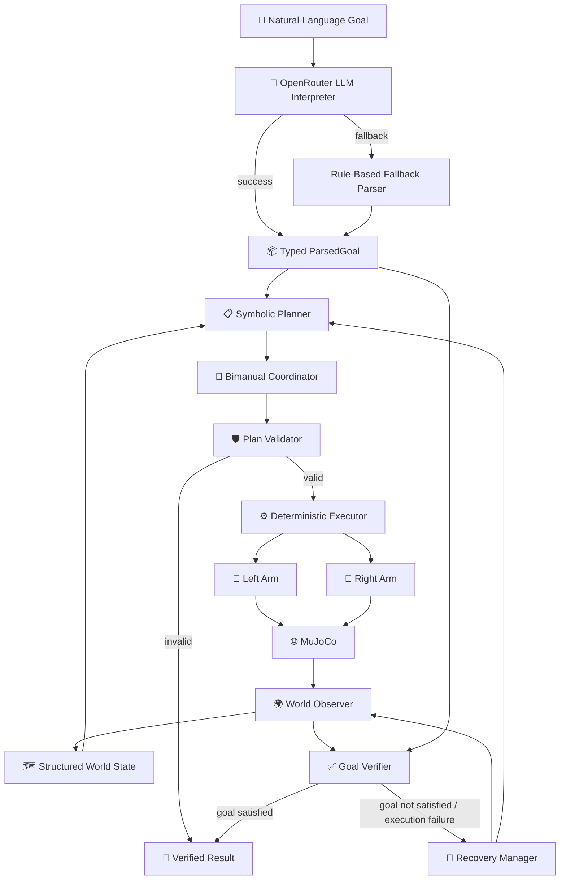

<div align="center">

# 🤖 TaskForge VLA

### Adaptive Language-Guided Bimanual Manipulation

**Tell two robots what you want done. TaskForge figures out how.**

[](https://www.python.org/)
[](https://mujoco.org/)
[](https://streamlit.io/)
[](https://docs.pydantic.dev/)

**Built for the AI Infra Summit Hackathon 2026**  
**Track: Intel — Bimanual VLA Manipulation with Multi-Modal Reasoning**

</div>

---

## ✨ What is TaskForge VLA?

**TaskForge VLA** is a simulation-first embodied-AI system for controlling two robotic arms with natural-language instructions.

Instead of manually scripting every joint movement, a user can give TaskForge a goal such as:

```text
Pick both blocks.
```

or:

```text
Put the red block near the blue one.
```

TaskForge then:

1. interprets the instruction with an LLM;
2. converts it into a typed goal;
3. observes the current world state;
4. generates a symbolic manipulation plan;
5. assigns actions to the most suitable arm;
6. validates the plan before execution;
7. executes deterministic robot primitives in MuJoCo;
8. observes the world again;
9. verifies the original goal;
10. recovers and replans if execution fails.

The core idea is:

> **AI proposes. Structured systems validate. Deterministic robotics executes. The environment decides whether the task actually succeeded.**

TaskForge does **not** give an LLM direct access to robot joints.

---

## 🎯 Why TaskForge?

Traditional robot control often requires low-level scripting:

```text
rotate joint
move end effector
close gripper
move to coordinate
open gripper
```

TaskForge aims for:

```text
"Put the red block to the left of the blue block."
```

The system translates human intent into a structured, validated and verifiable manipulation workflow.

This makes robot behavior easier to:

- understand;
- inspect;
- validate;
- recover;
- demonstrate;
- extend to richer embodied-AI tasks.

---

# 🚀 Current Prototype

The current prototype already supports a complete end-to-end loop from **natural language to verified dual-arm MuJoCo execution**.

### ✅ Implemented

- Natural-language task input
- OpenRouter LLM goal interpretation
- Deterministic rule-based parser fallback
- Pydantic typed goal schemas
- Structured world model
- Symbolic plan generation
- Reachability-aware bimanual arm assignment
- IK-based robot motion
- Gripper open/close control
- Pick primitive
- Place/release primitive
- Move-home primitive
- Plan dependency handling
- Deterministic plan validation
- Invalid-object / invalid-plan rejection
- Spatial predicates:
  - `left_of`
  - `right_of`
  - `near`
  - `grasped_by`
- Final world-state verification
- Controlled failure injection
- Residual-goal generation
- Automatic replanning
- Partial-progress preservation
- Occupied-arm awareness during recovery
- Streamlit dashboard
- Headless MuJoCo execution
- Live native MuJoCo viewer mode
- Standalone live viewer demo

---

# 🧠 System Architecture



---

# 🔄 TaskForge Closed Loop

```text
NATURAL-LANGUAGE GOAL
        ↓
INTERPRET
        ↓
OBSERVE
        ↓
PLAN
        ↓
COORDINATE
        ↓
VALIDATE
        ↓
EXECUTE
        ↓
OBSERVE
        ↓
VERIFY
        ↓
SUCCESS
```

If execution fails:

```text
EXECUTION FAILURE
        ↓
OBSERVE CURRENT WORLD
        ↓
PRESERVE COMPLETED WORK
        ↓
BUILD RESIDUAL GOAL
        ↓
REPLAN
        ↓
VALIDATE
        ↓
EXECUTE RECOVERY
        ↓
VERIFY ORIGINAL GOAL
        ↓
RECOVERY_SUCCESS
```

A completed action sequence is **not** automatically treated as success.  
TaskForge checks the final environment state against the user's original goal.

---

# 🤝 Reachability-Aware Bimanual Coordination

TaskForge does not blindly hard-code one object to one arm.

For automatic arm assignment it evaluates:

- whether an arm can reach the pick waypoints;
- whether an arm can reach the placement waypoints;
- MuJoCo joint limits;
- IK feasibility;
- posture quality;
- near-singular configurations;
- whether an arm is already occupied.

Example:

```text
Target: red_block

left_arm:  reachable=True, score=1.015
right_arm: reachable=True, score=2.464

SELECTED_ACTOR: left_arm
```

For a two-object task, TaskForge can produce:

```text
left_arm  -> red_block
right_arm -> blue_block
```

because that assignment is selected from the current geometry rather than from object color alone.

---

# 🛡️ Validate Before You Move

Generated plans cannot directly control the robot.

Every plan passes through a deterministic validator before execution.

Example invalid proposal:

```json
{
  "actor": "left_arm",
  "action": "pick",
  "target": "unicorn"
}
```

If the object does not exist:

```text
PLAN_INVALID
[UNKNOWN_OBJECT]
Execution blocked.
```

The validator checks conditions such as:

- actor exists;
- target object exists;
- action is supported;
- object is graspable;
- dependencies are valid;
- dependency graph is acyclic;
- symbolic grasp state is consistent;
- placement actions are logically possible.

This creates a strict boundary between AI interpretation and robot execution.

---

# 🔁 Failure Recovery and Replanning

Failure handling is a working part of the current prototype.

TaskForge can deliberately inject a recoverable failure for demonstration and testing.

Example:

```text
Initial plan:
a1 left_arm  -> pick(red_block)     ✅
a2 left_arm  -> move_home           ✅
a3 right_arm -> pick(blue_block)    ❌ injected failure
```

TaskForge then observes the updated world:

```text
red_block is already grasped by left_arm
blue_block is still unfinished
```

Instead of restarting the task, it creates a residual goal:

```text
pick blue_block
```

Then:

```text
RECOVERY_WORLD_OBSERVED
RECOVERY: skipping red_block - already grasped by left_arm
RESIDUAL GOAL CREATED
REPLANNING_FROM_CURRENT_WORLD
RECOVERY_PLAN_VALID
RECOVERY_EXECUTION_SUCCESS
RECOVERY_SUCCESS
```

This is a core design goal of TaskForge: **recover from the world that actually exists, not from the world the original plan expected.**

---

# 🌍 Structured World Model

TaskForge maintains a machine-readable world state.

Example:

```json
{
  "objects": {
    "red_block": {
      "object_class": "block",
      "position": [0.15, 0.0, 0.45],
      "graspable": true,
      "grasped_by": null
    },
    "blue_block": {
      "object_class": "block",
      "position": [-0.15, 0.0, 0.45],
      "graspable": true,
      "grasped_by": null
    }
  },
  "robots": {
    "left_arm": {
      "status": "idle"
    },
    "right_arm": {
      "status": "idle"
    }
  }
}
```

The observed world state is authoritative.

The LLM is allowed to interpret intent, but it is **not allowed to invent robot state or bypass validation**.

---

# 📐 Spatial Reasoning

Current supported predicates include:

```text
left_of(A, B)
right_of(A, B)
near(A, B)
grasped_by(A, robot)
```

This lets users describe relationships rather than raw coordinates.

Example:

```text
Put the red block near the blue one.
```

TaskForge computes a placement target, performs the manipulation, observes the final world and verifies:

```text
near(red_block, blue_block) -> True
GOAL_SATISFIED
```

---

# 🧪 Validated Demo Scenarios

The current build has been validated on the following demo paths.

### 1. Normal bimanual pick

```text
Pick both blocks
```

Observed result:

```text
left_arm -> red_block
right_arm -> blue_block

PICK_SUCCESS
PICK_SUCCESS
EXECUTION_SUCCESS

grasped_by(red_block, auto) -> True
grasped_by(blue_block, auto) -> True

GOAL_SATISFIED
```

### 2. Relational placement

```text
Put the red block near the blue one
```

Observed result:

```text
PICK_SUCCESS
PLACE_SUCCESS
near(red_block, blue_block) -> True
GOAL_SATISFIED
```

### 3. Automatic recovery

```text
Pick both blocks
```

with a controlled failure injected at the second pick:

```text
INJECTED_FAILURE
RECOVERY TRIGGERED
RESIDUAL GOAL CREATED
RECOVERY_PLAN_VALID
RECOVERY_EXECUTION_SUCCESS
RECOVERY_SUCCESS
```

### 4. Reachability-aware relational task

```text
Move the red block to the left side of the blue one
```

TaskForge evaluates both arms for the pick-and-place path, selects the arm able to complete the entire manipulation, executes it and verifies the final predicate.

---

# 💻 Streamlit Dashboard

TaskForge includes a lightweight Streamlit interface designed for hackathon demos.

The dashboard provides:

- natural-language task input;
- example task selection;
- LLM interpretation status;
- generated symbolic plan;
- execution status;
- final goal status;
- parsed goal JSON;
- world-state tables;
- robot-state tables;
- execution trace;
- recoverable-failure demo mode;
- optional live MuJoCo viewer.

Start it with:

```powershell
streamlit run streamlit_app.py
```

For the most visual demo:

1. keep **Show live MuJoCo viewer** enabled;
2. enter `Pick both blocks`;
3. press **Run Task**;
4. watch the robots execute in the native MuJoCo window;
5. inspect the plan and final result in Streamlit.

To demonstrate recovery, enable:

```text
Simulate recoverable failure
```

and run `Pick both blocks` again.

---

# 🎬 Live MuJoCo Demo

TaskForge also includes a standalone viewer script.

### Normal live execution

```powershell
python demo_with_viewer.py --instruction "Pick both blocks"
```

### Live recovery demo

```powershell
python demo_with_viewer.py --failure --instruction "Pick both blocks"
```

The second command intentionally fails one manipulation step once, then demonstrates observation, residual-goal generation, replanning and recovery.

The final simulation state remains visible until the MuJoCo viewer is closed.

---

# ⚙️ Tech Stack

| Layer | Technology |
|---|---|
| Core language | Python |
| Robotics simulation | MuJoCo |
| Robot motion | Analytical planar IK + position control |
| Typed schemas | Pydantic |
| LLM interpretation | OpenRouter |
| Current tested model | `inclusionai/ling-3.0-flash-vl:free` |
| Deterministic fallback | Rule-based instruction parser |
| Planning | Symbolic planner |
| Coordination | Reachability/posture-aware bimanual coordinator |
| Validation | Deterministic plan validator |
| Execution | Deterministic manipulation primitives |
| World model | Structured Python/Pydantic state |
| Verification | Goal predicate verifier |
| Recovery | Residual-goal replanning |
| Dashboard | Streamlit |
| Simulation viewer | Native MuJoCo viewer |

---

# 🗂️ Project Structure

```text
taskforge/
│
├── models/
│   └── scene.xml
│
├── taskforge/
│   │
│   ├── coordination/
│   │   └── bimanual_coordinator.py
│   │
│   ├── execution/
│   │   └── executor.py
│   │
│   ├── instruction/
│   │   └── parser.py
│   │
│   ├── llm/
│   │   └── openrouter_interpreter.py
│   │
│   ├── orchestration/
│   │   └── task_runner.py
│   │
│   ├── planner/
│   │   └── symbolic_planner.py
│   │
│   ├── recovery/
│   │   ├── failure_injector.py
│   │   └── recovery_manager.py
│   │
│   ├── robot/
│   │   ├── arm.py
│   │   └── ik.py
│   │
│   ├── schemas/
│   │   ├── goal.py
│   │   ├── plan.py
│   │   └── world.py
│   │
│   ├── simulation/
│   │   └── mujoco_backend.py
│   │
│   ├── validator/
│   │   └── plan_validator.py
│   │
│   ├── verification/
│   │   └── goal_verifier.py
│   │
│   └── world_model/
│       ├── observer.py
│       └── predicates.py
│
├── orchestrator_demo.py
├── recovery_demo.py
├── demo_with_viewer.py
├── streamlit_app.py
│
├── .env.example
├── .gitignore
└── README.md
```

---

# 🧰 Quick Start

## 1. Clone the repository

```bash
git clone https://github.com/builtbyrehan/taskforge-vla.git
cd taskforge-vla
```

## 2. Create a virtual environment

### Windows PowerShell

```powershell
python -m venv my-venv
.\my-venv\Scripts\Activate.ps1
```

### Linux / macOS

```bash
python3 -m venv my-venv
source my-venv/bin/activate
```

## 3. Install dependencies

The current MVP uses MuJoCo, Pydantic, Streamlit, OpenRouter HTTP access and dotenv configuration.

A minimal setup is:

```bash
pip install mujoco pydantic streamlit python-dotenv requests
```

If the repository includes a `requirements.txt`, prefer:

```bash
pip install -r requirements.txt
```

---

# 🔑 OpenRouter Configuration

Create a `.env` file in the project root:

```env
OPENROUTER_API_KEY=your_openrouter_key_here
OPENROUTER_MODEL=inclusionai/ling-3.0-flash-vl:free
```

Do **not** commit `.env`.

The project is designed so that if the OpenRouter interpretation path is unavailable, TaskForge can fall back to its deterministic parser for supported instructions.

---

# ▶️ Running TaskForge

### Terminal orchestration demo

```powershell
python orchestrator_demo.py
```

Example:

```text
Pick both blocks
```

### Recovery demo

```powershell
python recovery_demo.py
```

### Streamlit dashboard

```powershell
streamlit run streamlit_app.py
```

### Standalone MuJoCo viewer

```powershell
python demo_with_viewer.py --instruction "Pick both blocks"
```

### Standalone recovery + MuJoCo viewer

```powershell
python demo_with_viewer.py --failure --instruction "Pick both blocks"
```

---

# 💬 Example Instructions

```text
Pick both blocks
```

```text
Pick the red block with the left arm
```

```text
Use the right arm to pick up the blue block
```

```text
Move the red block to the left side of the blue one
```

```text
Put the red block to the right of the blue block
```

```text
Put the red block near the blue one
```

---

# 📊 Development Status

| Capability | Status |
|---|:---:|
| MuJoCo scene | ✅ |
| Single-arm motion | ✅ |
| Dual-arm control | ✅ |
| Analytical IK | ✅ |
| Gripper control | ✅ |
| Pick primitive | ✅ |
| Place / release primitive | ✅ |
| Structured world state | ✅ |
| Spatial predicates | ✅ |
| Typed goal schema | ✅ |
| OpenRouter LLM interpretation | ✅ |
| Rule-based fallback parser | ✅ |
| Symbolic planner | ✅ |
| Reachability-aware arm coordinator | ✅ |
| Posture-aware arm scoring | ✅ |
| Plan dependency handling | ✅ |
| Plan validator | ✅ |
| Execution engine | ✅ |
| Invalid-plan blocking | ✅ |
| Final goal verification | ✅ |
| Controlled failure injection | ✅ |
| Residual-goal generation | ✅ |
| Automatic replanning | ✅ |
| Recovery from partial progress | ✅ |
| Streamlit dashboard | ✅ |
| Headless execution | ✅ |
| Live MuJoCo viewer demo | ✅ |
| Camera perception | 🔜 |
| Exact SO-101 simulation model | 🔜 |
| True parallel arm execution | 🔜 |
| Learned VLA policy | 🔜 |
| Physical robot integration | 🧪 Future |
| Sim-to-real transfer | 🧪 Future |

---

# 🏆 Hackathon

TaskForge VLA is being developed for the **AI Infra Summit Hackathon 2026**.

Target challenge:

> **Intel — Bimanual VLA Manipulation with Multi-Modal Reasoning**

The MVP is intentionally **simulation-first**. This allowed development to focus on the system-level problems that matter most to the project:

- language-guided manipulation;
- structured world representation;
- bimanual task assignment;
- validation before actuation;
- deterministic robot execution;
- execution-aware recovery;
- final-state verification.

TaskForge is an independent hackathon project and is not an official Intel product.

---

# 🧱 Design Philosophy

### 🧠 Interpret

Use AI where flexible language understanding is useful.

### 📦 Structure

Convert model output into typed, machine-readable goals.

### 🛡️ Validate

Never allow model output to bypass deterministic checks.

### 🤖 Execute

Use controlled robotics primitives for physical actions.

### 🌍 Observe

Treat the environment, not the original plan, as ground truth.

### 🔁 Recover

Replan only the remaining work when execution does not match expectations.

### ✅ Verify

Success means the final world satisfies the user's goal.

---

# ⚠️ Current Limitations

TaskForge is a hackathon prototype, not an industrial robot-control system.

The current version:

- uses MuJoCo ground-truth simulator state rather than camera perception;
- uses simplified two-degree-of-freedom planar prototype arms;
- does not yet use an exact simulated SO-101 morphology;
- uses a deterministic assisted-attachment abstraction after grasp verification;
- supports a small set of objects and manipulation goals;
- currently executes bimanual actions sequentially rather than truly concurrently;
- uses an LLM for semantic goal interpretation, not direct low-level robot control;
- does not train a proprietary VLA foundation model;
- does not yet perform multimodal camera reasoning;
- has not demonstrated sim-to-real transfer;
- has not been validated for physical robot safety.

These limitations are intentional and keep the MVP focused on the closed-loop planning, validation, coordination and recovery architecture.

---

# 🔮 Next Directions

Potential extensions include:

- exact SO-101 robot simulation;
- richer object sets;
- camera-based perception;
- vision-language scene understanding;
- multimodal instruction input;
- cooperative two-arm manipulation;
- true parallel execution;
- learned manipulation policies;
- physical hardware integration;
- sim-to-real experiments;
- richer failure classes;
- reproducible benchmark suites.

---

# 📄 License

A final open-source license has not yet been selected.

Before public distribution, add a `LICENSE` file and update this section.

Common choices include:

- MIT
- Apache-2.0
- BSD-3-Clause

---

# 🙌 Acknowledgements

TaskForge is built on technologies and ideas from robotics, embodied AI and open-source software, including:

- MuJoCo;
- Pydantic;
- Streamlit;
- OpenRouter;
- symbolic task planning;
- inverse kinematics;
- language-guided manipulation;
- execution-aware robot recovery.

---

<div align="center">

## 🤖 TaskForge VLA

### From human intent to validated robot action.

**Goal → Interpret → Observe → Plan → Coordinate → Validate → Act → Recover → Verify**

**Built for the AI Infra Summit Hackathon 2026**

</div>
